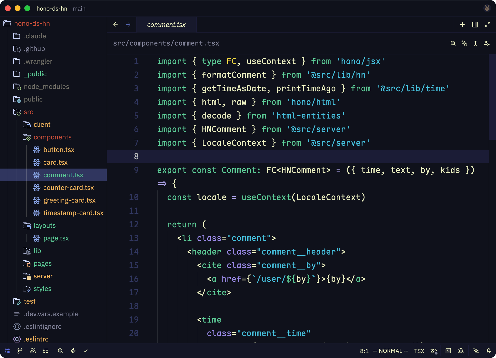
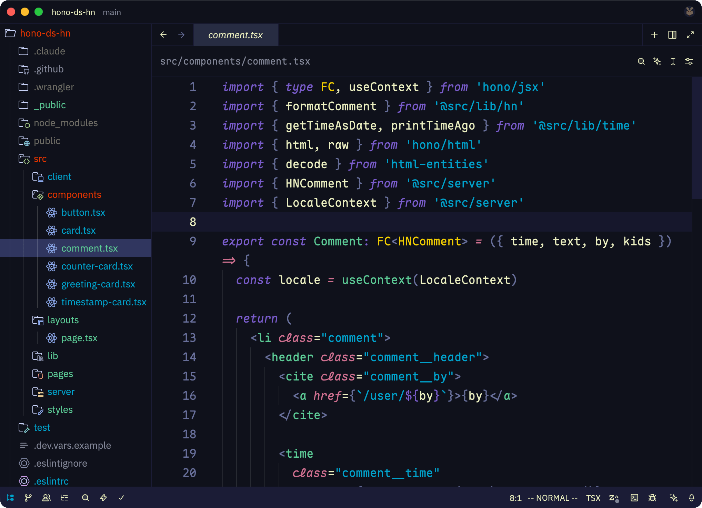
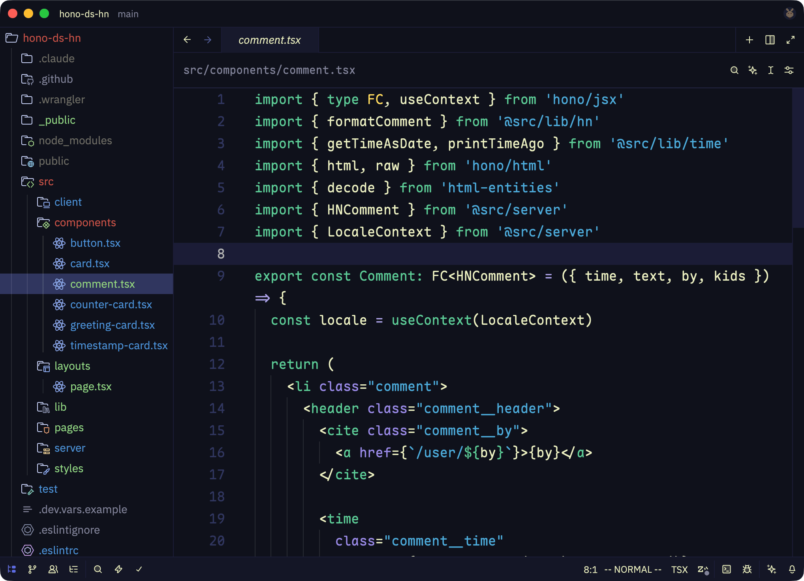
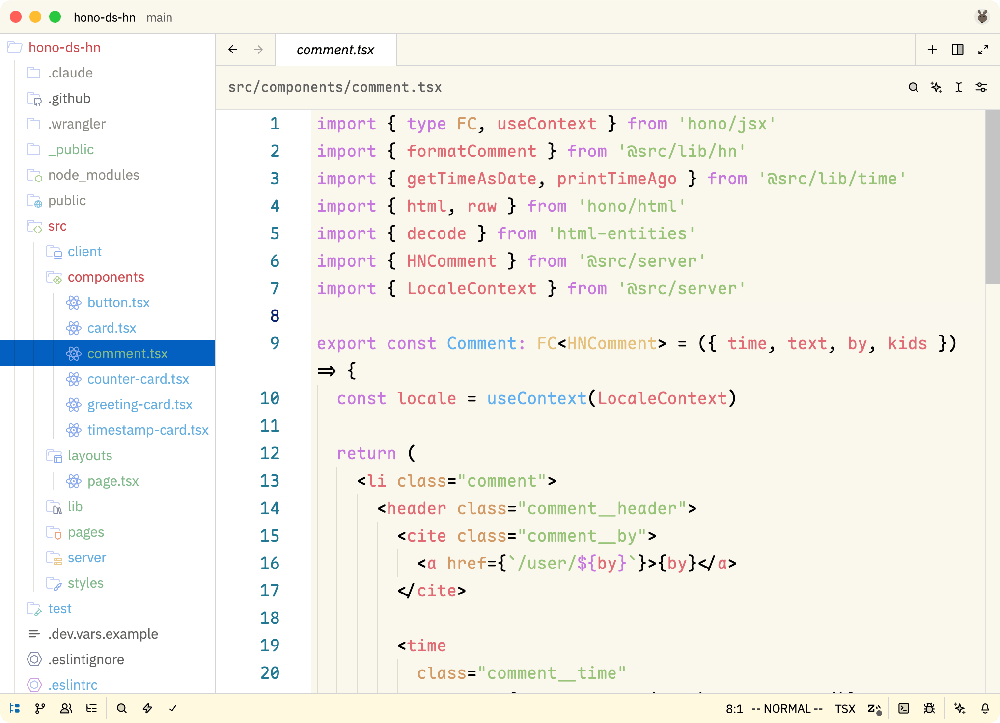

# Spaceduck for Zed

A port of the [Spaceduck](https://github.com/spaceduck-theme/vscode) color theme for [Zed](https://zed.dev/).

## Variants

    
🦆 Spaceduck

    

    
😎 Spaceduck OG

    

    
🌌 Spaceduck Mira

    

    
🌅 Spaceduck Light

    

## Installation

### Manual

1. Download `spaceduck.json` from the latest release.
2. Place it in `~/.config/zed/themes/`.
3. Open the command palette and enter **theme selector: toggle**.

## Credits

Original Spaceduck theme: [spaceduck-theme/vscode](https://github.com/spaceduck-theme/vscode).
